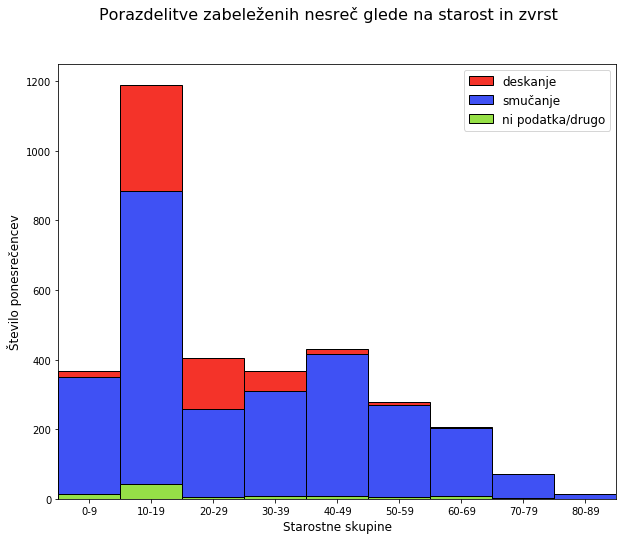

## Fakulteta za računalništvo in informatiko, Univerza v Ljubljani
---
### avtor: Urban Papler
### datum: 2. 4. 2020

# Statistika nesreč na smučiščih
## vmesno poročilo
### (projektna naloga pri predmetu Podatkovno rudarjenje)

---

#### 1. Podatki in opis problema
V tem dokumentu bom predstavil zanimive ugotovitve, razne statistike in povezave iz evidence nesreč na smučiščih.

Podatke sem pridobil iz OPSI ([Odprti podatki Slovenije](https://podatki.gov.si/)), in sicer iz [Evidence nesreč na smučiščih][1].
Podatki so zapisani v dveh datotekah - ena beleži nesreče v obdobju med 1. 12. 2013 in 9. 3. 2017, druga pa v obdobju med 1. 11. 2017 in  2. 4. 2019. V datotekah so podatki zapisani v različnih formatih - nekatere statistike lahko izluščimo iz obeh tabel, nekateri atributi pa so prisotni le v eni izmed tabel. Zaradi tega se bo za nekatere ugotovitve uporabljala le ena izmed obeh tabel.
V tabeli je shranjenih veliko različnih atributov, kar nam bo omogočalo ugotoviti zelo zanimive povezave med podatki. Prva tabela ima poleg osnovnih podatkov (datum in čas, resnost poškodbe) predvsem tudi podatke o beleženju incidenta (skica, fotografija, prisotnost zdravnika, prisotnost nadzornika). Druga tabela pa se osredotoča bolj na podrobno beleženje nastalih poškodb ter na specifično smučišče, kjer je prišlo do nesreče.

Iz podatkov bi radi najprej ugotovili nekaj osnovnih statistik, kot so na primer število nesreč na dan, razčelnitev glede na resnost poškodbe, kateri dan v tednu oziroma kateri mesec oziroma ura dneva je najbolj nevarna ...
Nato bi se lotili bolj specifičnih ugotovitev in vezav, katere bi bilo možno prikazati na kakšnem grafu: distribucija ponesrečencev glede na starost, glede na spol, glede na zvrst uživanja na smučišču (smučanje, deskanje, sankanje, ostalo), resnost poškodbe glede na vzrok (prehitra vožnja, smučanje izven proge, utrujenost, nezadostno smučarsko znanje ...).

Podatki so bili obdelani (in rezultati predstavljeni) v [notebooku](../../PR01.ipynb).

---

#### 2. Osnovne statistike
Tu bi radi predstavili le nekaj osnovnih statistik, katere lahko pozneje uporabimo za primerjavo z bolj kompleksnejšimi statistikami:

|                   | tabela 1 | tabela 2 | skupaj     |
| -----------------:| --------:|--------: | ----------:|
| število atributov |       23 |       16 | 8 (presek) |
| število vnosov    |     3364 |     1893 |       5257 |
| število dni       |     1194 |      517 |       1711 |
| št. nesreč na dan |     2.82 |     3.66 |       3.07 |

Največ nesreč je bilo zabeleženih dne 19. 02. 2015, in sicer 33, zelo blizu pa je dan 17. 02. 2015 z 31 zabeleženimi nezgodami.

Število in delež poškodb glede na resnost poškodbe:

|          resnost |    n |  delež |
|  ---------------:| ----:| ------:|
|            lažja | 4873 | 92.70% |
|            hujša |  292 |  5.55% |
|             brez |   86 |  1.64% |
| materialna škoda |    3 |  0.06% |
|             smrt |    2 |  0.04% |
|     posebno huda |    1 |  0.02% |

---

#### 3. Starost ponesrečencev
Kako so smučarji in deskarji različnih starostnih skupin zastopani v statistiki nesreč?

Kot vidimo, je bilo največ ponesrečencev v starostni skupini med 10 in 19 let. Ostale starostne skupine (od 0 do 49 let) so v statistiki nesreč enakomerno zastopane, po 50. letu pa začnejo števila poškodovancev padati (verjetno zaradi manjše udeležbe na smučanjih in na splošno manjšega števila starejših prebivalcev).

Zanimivo je tudi slediti deležu zvrsti uživanja na snegu (smučanje in deskanje). Kot vidimo, je deskanje relativno popularno med osebami, starimi 10-30 let, pri naslednji starostni skupini pa delež deskarjev že začne padati. Deskarji, starejši od 40 let, skoraj niso več zastopani v statistiki nesreč (predvideno zaradi manjšega števila deskarjev te starosti).

[1]: https://podatki.gov.si/dataset/evidenca-nesrec-na-smuciscih1
